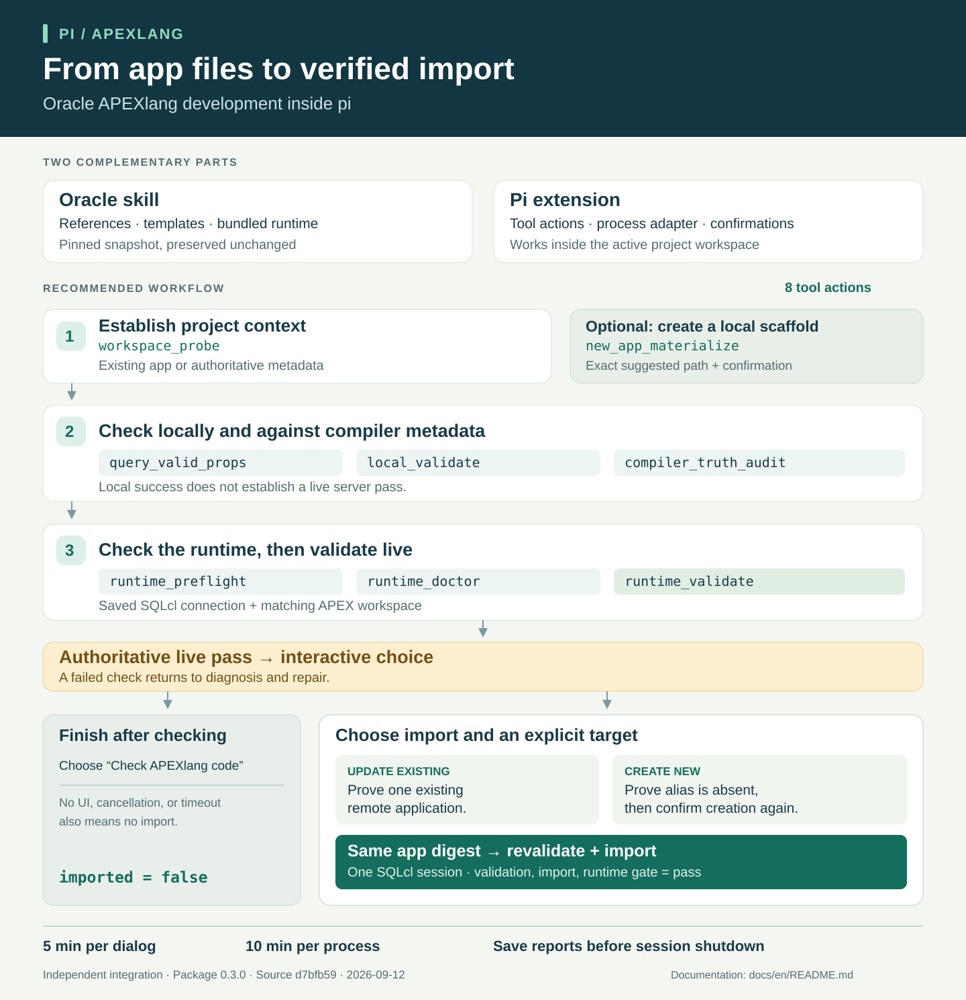

# pi-apexlang documentation

[Українська](../uk/README.md) · [Project README](../../README.md)

`pi-apexlang` connects the pi coding agent to Oracle's APEXlang development resources. The agent uses Oracle's templates and guidance to work on application files; the extension provides a controlled tool for discovery, scaffolding, validation, and runtime diagnostics. An import becomes available through an interactive choice after a successful live check.

This is an independent integration, not an Oracle product. The repository is named `pi-apex`; the package and its version are defined in [package.json](../../package.json).

## Read by task

| Your task | Guide |
| --- | --- |
| Install the package and check your first app | [Getting started](getting-started.md) |
| Understand the components and import flow | [Architecture](architecture.md) |
| Look up actions, parameters, and result evidence | [Tool reference](tool-reference.md) |
| Find reports, diagnose failures, or maintain the package | [Maintenance](maintenance.md) |

## At a glance

[Scalable infographic](../assets/overview.en.svg) · [PNG image](../assets/overview.en.png)

## What a successful check means

| Evidence | What it establishes |
| --- | --- |
| Local validation passes | The bundled vocabulary, DSL, and validation-rule checks passed. |
| Compiler-truth audit passes | Component structure and attributes passed checks against the selected compiler metadata. |
| Authoritative live validation passes | The runtime returned successful live-validator evidence for the application snapshot. |
| Import passes | Validation, import, and the runtime gate each returned `pass`. |

Local success alone does not establish that an app is valid on a particular server. A live check alone does not mean that the app was imported.

## Documentation baseline

These guides describe package version **0.4.0**, updated on **2026-09-22** with Oracle's **2026.09.21** APEXlang skill release, pinned in [`UPSTREAM.json`](../../UPSTREAM.json). The update adds Media List and Comments workflows, expands Metric Card, Cards, and Region Display Selector support, and strengthens Smart Filter and Search validation. See the bundled [Oracle release notes](../../skills/apexlang/release-notes.json).

Examples use illustrative paths and connection names. Server access, credentials, and deployment targets are supplied by the operator.

Implementation claims link to local source files. Oracle prerequisite links are provided in the setup guide. The compatibility table is an advisory maintained by this project; its recorded review date is independent of this documentation date. No production validation or import is implied by these guides.
