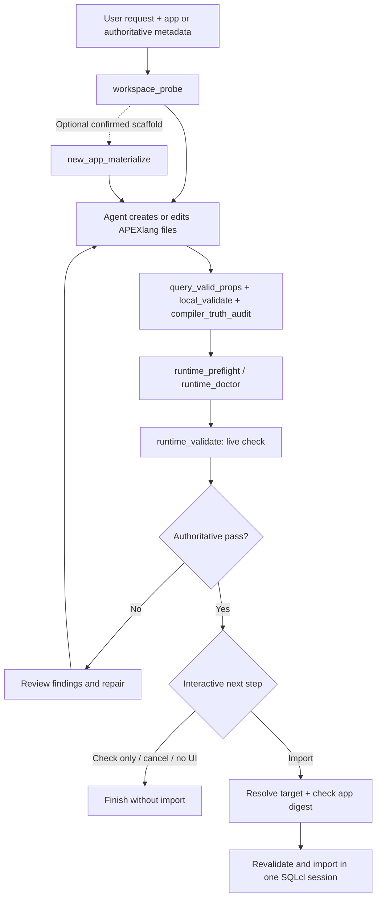

# Architecture

[Documentation](README.md) · [Українська](../uk/architecture.md)

## Components

| Layer | Responsibility | Source |
| --- | --- | --- |
| Oracle skill | Task routing, references, templates, and bundled Oracle runtime | [skills/apexlang](../../skills/apexlang) |
| Pi extension | Registers `apexlang`, exposes its schema, handles confirmation and session cleanup | [index.ts](../../extensions/apexlang/index.ts) |
| Process adapter | Builds argument arrays, checks paths and runtime context, tracks app digests, runs child processes | [apexlang-cli.mjs](../../extensions/lib/apexlang-cli.mjs) |
| Local validation wrapper | Runs vocabulary, DSL, and validation-rule checks | [apexlang-local-validate.mjs](../../extensions/lib/apexlang-local-validate.mjs) |
| Parser acceleration | Caches repeated block parsing and nesting lookups within one Python process | [apexlang-local-validator.py](../../extensions/lib/apexlang-local-validator.py) |
| Runtime bridge | Invokes the bundled roundtrip runtime; supports a controlled SQLcl PTY path | [roundtrip bridge](../../extensions/lib/apexlang-runtime-roundtrip.mjs), [PTY bridge](../../extensions/lib/apexlang-sqlcl-pty.py) |
| Compatibility advisory | Detects broad findings and presents version guidance | [compatibility.ts](../../extensions/apexlang/compatibility.ts), [table](../../extensions/apexlang/ords-sqlcl-compatibility.json) |

The skill is vendored unchanged at the commit and digest recorded in [UPSTREAM.json](../../UPSTREAM.json). The extension's acceleration wraps Oracle's validator; it does not edit the vendor snapshot or omit validation stages. Pi discovers the skill through the `pi.skills` package entry and loads task-specific material progressively.

## Working flow

This is the recommended workflow. The registered tool is not a scheduler that automatically runs all eight actions. Editing application code is work performed by the agent; there is no general-purpose `generate` or `edit` action in the tool schema.

## Import flow

1. `runtime_validate` must return a successful process result plus `live_check_status=pass` or `validation_status=pass`, and `validation_sources.live_validator.status=pass`.
2. With a UI, the extension offers **Check APEXlang code** or **Check and import APEXlang code**. Without a UI, it returns the live-check result with `imported=false`.
3. Choosing import requires a valid SHA-256 application digest and an explicit target mode:

   | Target mode | Required evidence |
   | --- | --- |
   | Update existing | Oracle resolves exactly one existing remote application. |
   | Create new | Oracle proves the alias is absent in the selected workspace without import authority; the user then confirms creation in an additional dialog. |

4. The adapter checks that the application snapshot still matches the approved digest. A changed tree requires revalidation.
5. Validation and import run together in one SQLcl session. The extension reports import success only when `validate_status`, `import_status`, and `runtime_gate_status` are all `pass`, with a successful process result.

There is no standalone import action in the model-visible action list. Every confirmation and selection dialog receives the abort signal and a five-minute timeout. Selecting nothing never authorizes import. These are controls implemented by the package; they do not replace the database privileges of the saved connection.

## Runtime staging and evidence

App-scoped runtime operations require a JSON object in `deployments/default.json`. The adapter accepts workspace metadata under `workspace.name` or the exported `app.workspace.name`, rejects conflicts, and compares it with the explicit `workspace_name` without case sensitivity. An unresolved `__REQUIRED_WORKSPACE_NAME__` placeholder is rejected.

When normalization is needed, the adapter copies the app under the session output root and injects the workspace there. A runtime check may use the original app when top-level workspace metadata is already suitable. Import and create-new proof always force staging. The digest normalizes JSON formatting and the injected `workspace.name`; other deployment properties remain part of the digest.

The extension creates a temporary `pi-apexlang-*` output directory on first use and reuses it during the session. Reports and runtime context therefore share a stable session root. Known validation/roundtrip evidence is cleared before a new corresponding run. The entire output root is removed on `session_shutdown`: copy needed evidence before ending the session.

## Execution boundaries

Application paths stay inside the active Pi workspace. The adapter checks real paths, rejects symlinks in app trees and relevant discovery inputs, and rejects multiply linked files for vocabulary rewrites. Commands use argument arrays rather than shell interpolation. Cancellation, timeout, or excess output terminates the spawned process tree.

The tool runs sequentially. Its configured command timeout is **10 minutes per invoked process**, not a total deadline for a multi-phase action. The adapter's default combined process-output limit is **8 MiB**; text presented to the model is trimmed at **80,000 characters**, with the full report location retained.

See [runner tests](../../test/runner.test.mjs) and [extension tests](../../test/extension.test.mjs) for executable examples of these boundaries.
