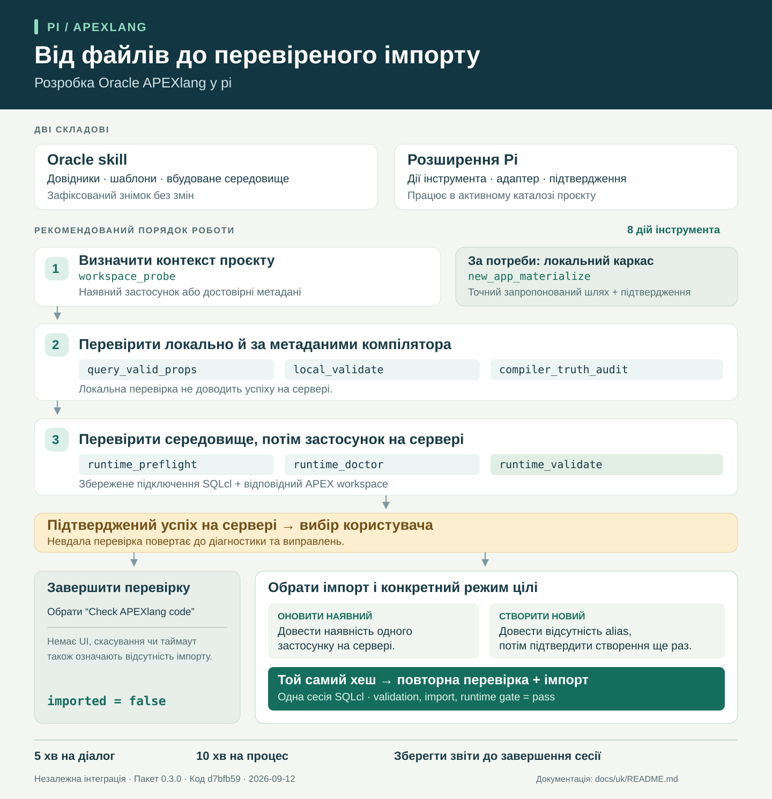

# Документація pi-apexlang

[English](../en/README.md) · [README проєкту](../../README.md)

`pi-apexlang` поєднує агента розробки pi з ресурсами Oracle для APEXlang. Агент використовує шаблони та настанови Oracle для роботи з файлами застосунку; розширення надає інструмент із визначеними діями для пошуку контексту, створення каркаса, перевірки й діагностики середовища. Імпорт стає доступним через інтерактивний вибір після успішної перевірки на сервері.

Це незалежна інтеграція, а не продукт Oracle. Репозиторій має назву `pi-apex`; назву та версію пакета визначено в [package.json](../../package.json).

## Оберіть матеріал за задачею

| Ваша задача | Посібник |
| --- | --- |
| Установити пакет і перевірити перший застосунок | [Початок роботи](getting-started.md) |
| Зрозуміти компоненти та порядок імпорту | [Архітектура](architecture.md) |
| Знайти дії, параметри та докази результату | [Довідник інструмента](tool-reference.md) |
| Знайти звіти, з'ясувати причини помилок або оновити пакет | [Супровід](maintenance.md) |

## Загальна схема

[Масштабована інфографіка](../assets/overview.uk.svg) · [Зображення PNG](../assets/overview.uk.png)

## Що означає успішна перевірка

| Доказ | Що він підтверджує |
| --- | --- |
| Успішна локальна перевірка | Пройдено вбудовані перевірки словника, DSL і правил валідацій. |
| Успішний аудит compiler-truth | Структуру й атрибути компонентів перевірено за вибраними метаданими компілятора. |
| Підтверджена успішна серверна перевірка | Середовище повернуло докази успіху live-валідатора для знімка застосунку. |
| Успішний імпорт | Перевірка, імпорт і контроль середовища повернули `pass`. |

Самої локальної перевірки недостатньо, щоб підтвердити коректність застосунку на конкретному сервері. Успішна серверна перевірка сама по собі не означає, що застосунок імпортовано.

## Основа документації

Посібники описують версію пакета **0.4.0**, оновлену **2026-09-22** зі skill Oracle APEXlang релізу **2026.09.21**, зафіксованим у [`UPSTREAM.json`](../../UPSTREAM.json). Оновлення додає сценарії Media List і Comments, розширює підтримку Metric Card, Cards та Region Display Selector і посилює перевірки Smart Filter та Search. Див. включені до пакета [release notes Oracle](../../skills/apexlang/release-notes.json).

Шляхи та назви підключень у прикладах умовні. Доступ до сервера, облікові дані й цілі розгортання визначає оператор.

Твердження про реалізацію містять посилання на локальні джерела. Посилання на вимоги Oracle наведено в посібнику з початку роботи. Таблиця сумісності — рекомендаційний матеріал цього проєкту; дата її перевірки відрізняється від дати документації. Ці посібники не підтверджують перевірку чи імпорт у робочому серверному середовищі.
