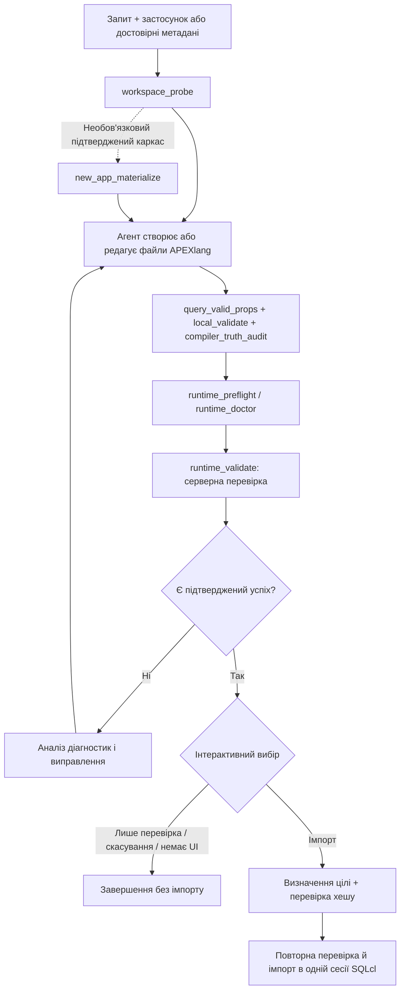

# Архітектура

[Документація](README.md) · [English](../en/architecture.md)

## Компоненти

| Шар | Відповідальність | Джерело |
| --- | --- | --- |
| Oracle skill | Маршрутизація задач, довідкові матеріали, шаблони та вбудоване середовище Oracle | [skills/apexlang](../../skills/apexlang) |
| Розширення Pi | Реєстрація `apexlang`, схема параметрів, підтвердження та очищення сесії | [index.ts](../../extensions/apexlang/index.ts) |
| Адаптер процесів | Масиви аргументів, перевірки шляхів і контексту, контроль хешів застосунку, запуск дочірніх процесів | [apexlang-cli.mjs](../../extensions/lib/apexlang-cli.mjs) |
| Обгортка локальних перевірок | Перевірки словника, DSL і правил валідацій | [apexlang-local-validate.mjs](../../extensions/lib/apexlang-local-validate.mjs) |
| Прискорення парсера | Кешування повторного розбору блоків і запитів вкладеності в межах одного Python-процесу | [apexlang-local-validator.py](../../extensions/lib/apexlang-local-validator.py) |
| Міст до середовища | Виклик вбудованого roundtrip-середовища; підтримка керованого шляху SQLcl через PTY | [roundtrip-міст](../../extensions/lib/apexlang-runtime-roundtrip.mjs), [PTY-міст](../../extensions/lib/apexlang-sqlcl-pty.py) |
| Рекомендації щодо сумісності | Виявлення масових діагностик і відображення рекомендацій щодо версій | [compatibility.ts](../../extensions/apexlang/compatibility.ts), [таблиця](../../extensions/apexlang/ords-sqlcl-compatibility.json) |

Skill збережено без змін на коміті та з хешем, зазначеними в [UPSTREAM.json](../../UPSTREAM.json). Прискорення розширення обгортає валідатор Oracle; воно не редагує копію постачальника й не пропускає етапи перевірки. Pi знаходить skill через запис `pi.skills` пакета та поступово завантажує матеріали конкретної задачі.

## Робочий процес

Це рекомендований порядок роботи. Зареєстрований інструмент не є планувальником, який автоматично виконує всі вісім дій. Код застосунку редагує агент; у схемі інструмента немає універсальної дії `generate` чи `edit`.

## Порядок імпорту

1. `runtime_validate` має повернути успішний результат процесу, `live_check_status=pass` або `validation_status=pass`, а також `validation_sources.live_validator.status=pass`.
2. За наявності UI розширення пропонує **Check APEXlang code** або **Check and import APEXlang code**. Без UI воно повертає результат серверної перевірки з `imported=false`.
3. Вибір імпорту потребує коректного SHA-256 хешу застосунку та явного режиму цілі:

   | Режим цілі | Необхідний доказ |
   | --- | --- |
   | Оновити наявний | Oracle визначає рівно один наявний застосунок на сервері. |
   | Створити новий | Oracle доводить відсутність alias у вибраному workspace без права імпорту; після цього користувач підтверджує створення в додатковому діалозі. |

4. Адаптер перевіряє, чи знімок застосунку досі відповідає погодженому хешу. Зміни дерева потребують повторної перевірки.
5. Перевірка й імпорт виконуються разом в одній сесії SQLcl. Розширення повідомляє успішний імпорт лише за успішного результату процесу та `pass` у всіх полях: `validate_status`, `import_status`, `runtime_gate_status`.

У переліку дій, доступному моделі, немає окремої дії імпорту. Кожен діалог підтвердження та вибору отримує сигнал скасування й таймаут п'ять хвилин. Відсутність вибору ніколи не дозволяє імпорт. Це механізми контролю пакета; вони не замінюють права збереженого підключення в базі даних.

## Тимчасова копія та докази виконання

Операції середовища з указаним застосунком потребують JSON-об'єкта в `deployments/default.json`. Адаптер приймає workspace з `workspace.name` або експортованого `app.workspace.name`, відхиляє конфлікти та порівнює назву з явним `workspace_name` без урахування регістру. Невизначений заповнювач `__REQUIRED_WORKSPACE_NAME__` відхиляється.

Коли потрібна нормалізація, адаптер копіює застосунок до каталогу результатів сесії та додає workspace саме там. Перевірка середовища може використовувати оригінал, якщо метадані workspace верхнього рівня вже придатні. Імпорт і перевірка відсутності нового застосунку завжди створюють тимчасову копію. Хеш нормалізує форматування JSON і додане `workspace.name`; інші властивості розгортання залишаються його частиною.

Розширення створює тимчасовий каталог результатів `pi-apexlang-*` під час першого виклику й повторно використовує його в межах сесії. Тому звіти й контекст середовища мають спільний стабільний корінь сесії. Відомі докази validation/roundtrip очищаються перед відповідним новим запуском. На `session_shutdown` весь каталог результатів видаляється: скопіюйте потрібні докази до завершення сесії.

## Межі виконання

Шляхи застосунку залишаються в активному робочому каталозі Pi. Адаптер перевіряє реальні шляхи, відхиляє символічні посилання в деревах застосунків і відповідних вхідних файлах пошуку, а для переписування словника також відхиляє файли з кількома жорсткими посиланнями. Команди використовують масиви аргументів без shell-інтерполяції. Скасування, таймаут або перевищення обсягу виводу зупиняє дерево запущеного процесу.

Інструмент працює послідовно. Налаштований таймаут команди — **10 хвилин на окремий запущений процес**, а не загальний ліміт багатоетапної дії. Типовий ліміт сумарного виводу процесу — **8 MiB**; текст для моделі обрізається на **80 000 символів** зі збереженням адреси повних звітів.

Виконувані приклади цих меж наведено в [тестах адаптера](../../test/runner.test.mjs) і [тестах розширення](../../test/extension.test.mjs).
